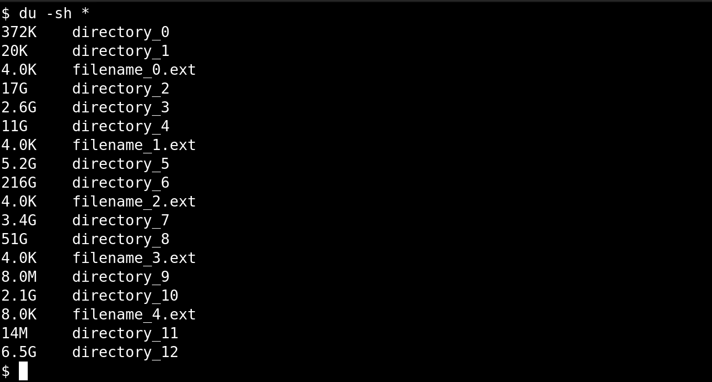

# Colorful `du`

This is a small helper script to turn this:



into this:


which makes it easier to spot which directories are worth investigating when 
you need to clean up disk space (without going full ncdu or baobab).

# Usage

Install the requirements (`pip install -r ./requirements.txt`), put the 
`colordu.py` script somewhere, then alias it in your `~/.bashrc` (or other 
shell config), as follows:
```
alias du="/path/to/colordu.py"
```
Open a new terminal or run `source ~/.bashrc`, then use `du` like you normally 
would.

There are some colorschemes defined, you can switch to them by setting the 
`COLORDU_SCHEME` environment variable, as follows:
```
COLORDU_SCHEME="YLORBR" du -sh *
```
Supported colorschemes are sourced from [this excellent guide on color 
schemes](https://personal.sron.nl/~pault/data/colourschemes.pdf):
```
NONE                # disable color
DISCRETE_RAINBOW    # rainbow v1
SMOOTH_RAINBOW      # rainbow v2
SUNSET              # sunset (default)
YLORBR              # yellow, orange, brown
PARTIAL_SUNSET      # partial sunset
```

# Notes & Limitations

Mainly tested with `du` and `du -sh`. Argument to `du` are not parsed, so 
things like `--block-size` are not supported. Assumes your terminal is using 
utf-8 encoding.

See LICENSE file for licensing information. Copyright (c) G.J.J. van den Burg.

I made this for myself and will offer only very limited support.
